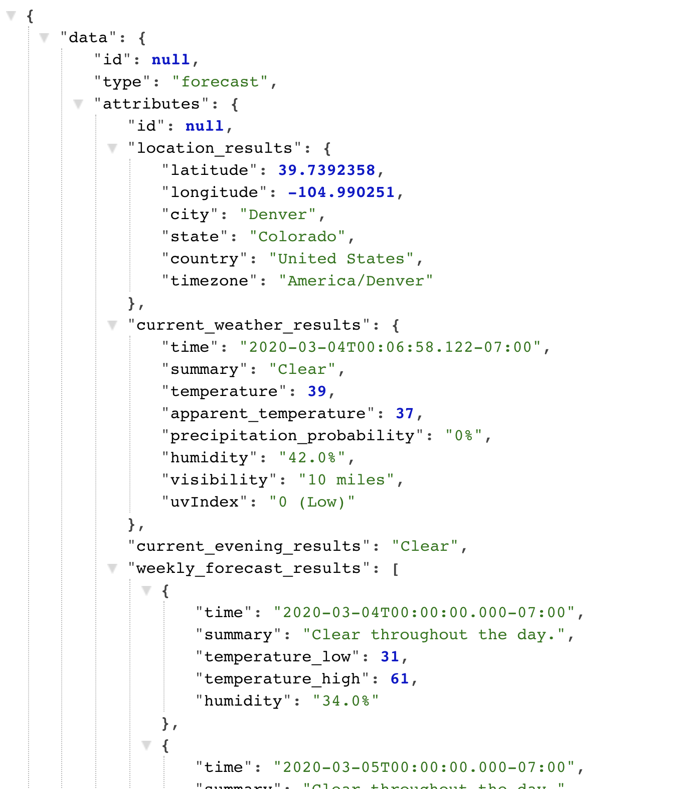

# Introduction
This is a solo project for Mod 3 students. Students were required to utilize multiple APIs (some of which required an authentication token), and expose an API to aggregate data and for CRUD functionality. The complete set of project requirements and evaluation criteria can be found at https://backend.turing.io/module3/projects/sweater_weather/.

## Production 
This API has been hosted on Heroku at https://dashboard.heroku.com/apps/fierce-meadow-03802. 

## Ruby/Rails Versions
- Rails 6.0.2.1
- Ruby 2.5.1p57 

## Setup Instructions

1. Clone the directory to a local repository:

`git clone https://github.com/linda-le1/sweater_weather`

2. navigate into the project from your terminal:

`cd sweater_weather`

3. Bundle the included gems. This project does make use of several gems (see details for more information below).

`bundle install`

4. Get your database and tables created:

`rails db:create
rails db:migrate`

5. Run rspec to ensure all of the tests are passing.

## Gems Used

RSPEC gem was used for testing: https://github.com/rspec/rspec. 
Shoulda-Matchers were used in addition to the RSPEC testing suite: https://github.com/thoughtbot/shoulda-matchers. 
Netflix's fast JSON API gem was used to serialize the information: https://github.com/Netflix/fast_jsonapi. 
BCrypt was used for password encryption and authentication: https://github.com/codahale/bcrypt-ruby. 
Faraday was used as the HTTP client library to make connections and receive JSON from external API sources: https://github.com/lostisland/faraday.  

## Access Endpoints
These endpoints can be accessed locally from your computer or from the production link. Responses are rendered in JSON with FastAPI serializers.

### To start a local server:

You can type the following into your terminal:

`rails s`

Then open a browser and enter "localhost:3000".

`GET /api/v1/forecast`
- Location query is required (i.e Denver, CO)
- Example query
`https://fierce-meadow-03802.herokuapp.com/api/v1/forecast?location=denver,co`

`GET /api/v1/backgrounds`
- Location query is required (i.e Denver, CO)
- Example query
`https://fierce-meadow-03802.herokuapp.com/api/v1/backgrounds?location=denver,co`

`POST /api/v1/users`
- This query requires an email, password, and password confirmation as params. This will return an API key. 

`POST /api/v1/sessions`
- This query requires an email, password as params. Authorized login will return an API key. 

`POST /api/v1/road_trip`
- This query requires an origin location, destination location, and api key as params. 

